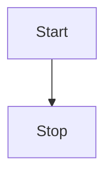

Gateway API는 가능한 한 업스트림 [쿠버네티스 문서 스타일 가이드](https://kubernetes.io/docs/contribute/style/style-guide/)를 준수하는 것을 목표로 한다. 이 가이드는 해당 가이드의 확장으로 간주되어야 한다. 상충하는 지침이 있을 경우, 이 가이드에 포함된 정보가 Gateway API 문서에 대해 우선권을 가진다.

## 프로젝트 이름
이 프로젝트의 이름은 "the Gateway API"가 아닌 "Gateway API"이다. 따라서 "the Gateway API"를 사용하는 것이 허용되는 유일한 경우는 "the Gateway API maintainers"와 같이 더 넓은 용어의 일부인 경우이다.

## 콜아웃
문서에서 콜아웃을 구현하기 위해 ``와 `` 같은 Hugo 숏코드를 사용한다.

### 릴리스 채널
가능한 한, 리소스나 기능이 현재 어떤 릴리스 채널에 포함되어 있는지, 그리고 해당 채널에 도입된 버전이 무엇인지 명확하게 명시하려고 노력한다. 이를 위해 `channel-version` 숏코드를 사용한다:


`HTTPRoute` 리소스는 GA이며 `v0.5.0`부터 Standard 채널에 포함되었다. 릴리스 채널에 대한 자세한 내용은 [버전 관리 가이드]()를 참조하자.



`TLSRoute` 리소스는 Alpha이며 `v0.3.0`부터 Experimental 채널에 포함되었다. 릴리스 채널에 대한 자세한 내용은 [버전 관리 가이드]()를 참조하자.


## 다이어그램
많은 경우, 다이어그램은 개념을 설명하는 가장 좋은 방법이다. 안타깝게도 다이어그램은 유지보수 및 업데이트가 어려울 수 있다. 다이어그램의 유지보수성을 보장하기 위해, [Mermaid](https://mermaid.js.org/) 다이어그램에 대한 내장 지원을 사용할 것을 강력히 권장한다. 다음은 다이어그램의 간단한 예시이다:

Mermaid 다이어그램을 사용하는 것이 실용적이지 않은 경우, 누구나 복사하여 필요에 따라 편집할 수 있는 소스에 대한 링크를 제공하자.
