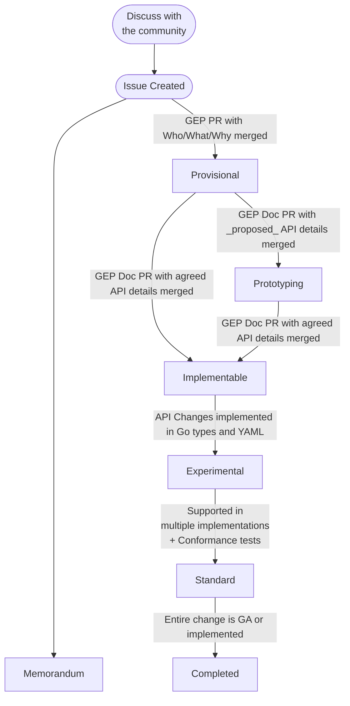

# Gateway Enhancement Proposal (GEP)

**Gateway Enhancement Proposal(GEP)**은 주요 Kubernetes 프로젝트의
[KEP][kep] 프로세스와 유사한 목적을 수행한다:

1. API 변경이 OSS 커뮤니티에서 알려진 프로세스와 논의를 따르도록 보장한다.
1. 변경 사항과 제안을 (현재 및 미래에) 검색 가능하게 한다.
1. 설계 아이디어, 트레이드오프, 결정 사항을 역사적 참고를 위해 문서화한다.
1. 더 큰 커뮤니티 토론의 결과를 기록한다.
1. GEP 프로세스 자체의 변경 사항을 기록한다.

## 프로세스

이 다이어그램은 GEP 프로세스의 상태 다이어그램을 높은 수준에서 보여주며, 세부 사항은 아래에 있다.

## GEP 정의

### GEP 상태 

각 GEP에는 GEP 프로세스에서의 위치를 추적하는 상태가 있다.

GEP는 어떤 상태에서든 다음 상태로 이동할 수 있다:

  * **Deferred:** 현재 이 GEP를 처리할 대역폭이 없으며,
    향후 재검토될 수 있다.
  * **Declined:** 이 제안은 커뮤니티에서 검토되었지만 최종적으로
  거부되었으며 추가 작업은 진행되지 않는다.
  * **Withdrawn:** 이 제안은 커뮤니티에서 검토되었지만 최종적으로
  저자에 의해 철회되었다.

Memorandum GEP를 다루는 특별한 상태가 있다:

  * **Memorandum**: 이 GEP는 다음 중 하나이다:
    * 추가 작업에 대한 합의를 문서화하며, 그 자체로는 spec 변경을 생성하지 않거나,
    * GEP 프로세스를 업데이트한다.

API GEP는 여러 상태를 거치며, 이는 일반적으로 GEP에서 설명하는
변경의 안정성 수준에 해당한다:

  * **Provisional:** 이 GEP에서 설명하는 목표에 대한 합의가 있지만
    구현 세부 사항은 아직 합의되지 않았다.
  * **Prototyping:** 커뮤니티에 이 GEP의 개발 일부로 의도된
    활발한 실제 테스트와 실험이 진행 중임을 나타내기 위한
    `Provisional`의 선택적 확장이다. API 또는 코드가 포함될 수 있지만
    해당 콘텐츠는 릴리스와 함께 배포되어서는 _안 된다_.
  * **Implementable:** 이 GEP에서 설명하는 목표와 구현 세부 사항에
    합의가 있지만 아직 완전히 구현되지 않았다.
  * **Experimental:** 이 GEP가 구현되어 "Experimental" 릴리스 채널의
    일부가 되었다. 완전한 제거 및 `Rejected`로의 이동을 포함하여
    호환성을 깨는 변경이 여전히 가능하다.
  * **Standard:** 이 GEP가 구현되어 "Standard" 릴리스 채널의 일부가 되었다.
    상당히 안정적이어야 한다.
  * **Completed**: 이 API GEP에 대한 모든 구현 작업이 완료되었다.

### GEP 간의 관계

GEP는 서로 관계를 가질 수 있다. 현재 세 가지 가능한 관계가 있다:

* **Obsoletes**와 그 역참조 **ObsoletedBy**: GEP가 다른 GEP에 의해 폐기되고
  기능이 완전히 대체될 때 사용한다. 폐기된 GEP는 **Declined** 상태로 이동한다.
* **Extends**와 그 역참조 **ExtendedBy**: GEP에 다른 GEP에서 추가
  세부 사항이나 구현이 추가될 때 사용한다.
* **SeeAlso**: GEP가 다른 GEP와 관련이 있지만 다른 정의된 방식으로는
  영향을 받지 않을 때 사용한다.

관계는 각 GEP에 동반되는 YAML 메타데이터 파일에서 추적된다.

### GEP 메타데이터 파일

각 GEP에는 메타데이터가 포함된 YAML 파일이 함께 있으며, GEP에 변경이
발생할 때 최신 상태로 유지해야 한다.

특히 `authors`와 `changelog` 필드에 유의하고, 이를 최신 상태로
유지해야 한다.

## 프로세스

### 1. 커뮤니티와 논의

GEP를 생성하기 전에 높은 수준의 아이디어를 커뮤니티와 공유한다.
이를 수행할 수 있는 여러 곳이 있다:

- [새 GitHub Discussion](https://github.com/kubernetes-sigs/gateway-api/discussions/new)
- [Slack 채널](https://kubernetes.slack.com/archives/CR0H13KGA)
- [커뮤니티 미팅](../contributing/index.md?h=meetings#meetings) 중 하나

GitHub Discussion을 기본으로 사용하길 권한다. 이는 GitHub 이슈와 매우 유사하게
작동하여 검색이 쉽다.

### 2. 이슈 생성
리포지토리에 변경 사항을 설명하는 [GEP 이슈를 생성](https://github.com/kubernetes-sigs/gateway-api/issues/new?assignees=&labels=kind%2Ffeature&template=enhancement.md)한다.
이 시점에서 다른 대화나 문서의 결과를 이 문서에 복사해야 한다.

### 3. `Provisional` - 목표에 합의

제안의 모든 세부 사항을 작성하기 시작하고 싶을 수 있지만,
먼저 모두가 목표에 동의하는지 확인하는 것이 중요하다.

API GEP의 경우, GEP의 첫 번째 버전은 "Provisional" 상태를 목표로 하고
구현 세부 사항은 제외하며 주로 "Goals"와 "Non-Goals"에
집중해야 하고, GEP가 "누구(Who)"를 위한 것인지, "무엇(What)"을
할 것인지, "왜(Why)" 필요한지를 문서화해야 한다. 이러한 이유로
`Provisional` 상태는 "Who/What/Why" 단계라고도 불린다.

Memorandum GEP의 경우, Memorandum에는 단일 단계(`Accepted`)만 있으므로
GEP의 첫 번째 버전이 유일한 버전이 된다.

`Provisional` 상태는 (`Memorandum`을 제외한) 다른 상태와 달리,
일반적인 Gateway API 릴리스 프로세스 밖에서 반복이 가능하다.
다시 말해, "Who/What/Why"에 대한 합의가 이루어지기 전까지는
PR이 정규 릴리스 프로세스에 포함되지 않는다.

GEP가 `Provisional` 단계에 진입하려면 다음이 필요하다:

* GEP-696 템플릿을 사용하여 제안의 "Who", "What", "Why"와
  Goals 및 Non-Goals를 설명하는 GEP PR이 `geps/` 디렉터리에 머지되어야 한다.

### 3. `Implementable` - 구현 세부 사항 문서화
모두가 목표에 동의했으므로 이제 제안된 구현 세부 사항을
작성할 차례이다. 이러한 구현 세부 사항은 제안된 API spec을 포함하고
관련 엣지 케이스를 다루는 등 매우 철저해야 한다.
잠재적 설계에 대한 빠른 반복을 위해 이 단계의 일부에서 공유 문서를
사용하는 것이 도움이 될 수 있다.

이 과정에서 다양한 대안을 논의할 가능성이 높다.
GEP에 이 모든 것과 왜 그것들을 선택하지 않았는지를 문서화해야 한다.
이 단계에서 GEP는 "Implementable" 단계를 목표로 해야 한다.

GEP가 `Implementable` 단계에 진입하려면 몇 가지 추가 요구 사항이 있다:

* Gateway API 메인테이너 1명 이상이 GEP가 프로젝트 범위 내에 있다는 데
  동의해야 한다.
* 최소 2개의 구현체가 `Experimental`에 도달한 후 6개월 이내에
  해당 기능을 구현할 의향이 있다고 동의해야 한다.
  이는 GEP 소유자 외부에 커뮤니티의 관심이 있는지 확인하기 위함이다.
* GEP 프로세스의 나머지 과정을 안내할 최소 1명의 "shepherd"가 지정되어야 한다.
  이 shepherd는 커뮤니티 멤버 누구나 될 수 있지만, GEP 프로세스 경험이 있는
  사람이 가장 도움이 된다. 해당 GEP의 shepherd는 초기 리뷰를 담당하고,
  GEP 소유자에게 프로세스에 관한 질문에 답변할 수 있어야 한다.
  GEP shepherd가 되는 것은 상당한 시간 투자가 필요하며,
  GEP가 복잡하거나 논쟁적일수록 필요한 시간이 급격히 증가한다.
  이 shepherd는 GEP 이슈에 기록되어야 한다.
* 기존의 `Provisional` 문서를 실제 변경에 필요한 세부 사항으로 업데이트하는
  GEP PR이 필요하다. 여기에는 모든 API 변경 사항과 구현체 및 적합성 테스트가
  목표로 삼을 초기 테스트 시나리오 세트가 포함되어야 한다. 이 단계에서는
  GEP 문서에 대한 변경 사항_만_ 포함되어야 한다.

### 4. `Experimental` - API 변경 적용

GEP가 "Implementable"로 표시되면 제안된 변경 사항을
API에 실제로 적용할 차례이다. 경우에 따라 이러한 변경은 문서만
해당되지만, 대부분의 경우 일부 API 변경도 필요하다. API의 모든
새 기능이 도입될 때 "Experimental"로 표시되는 것이 중요하다.
API 내에서는 `<gateway:experimental>` 태그를 사용하여 실험적 필드를 나타낸다.
Golang 패키지(적합성 테스트, CLI 등)에서는 `experimental` Golang 빌드 태그를 사용하여
실험적 기능을 나타낸다.

GEP를 `Experimental`로 표시하기 전에 다른 요구 사항도 충족해야 한다:

* 모든 API 변경 사항이 Go types에 반영되어야 한다.
* `Standard`에 도달하기 위한 졸업 기준이 반드시 작성되어야 한다.
  최소한 충분한 적합성 테스트가 포함되어야 하며, 해당 GEP에 관련된
  다른 기준도 포함되어야 한다.
* 적합성 테스트에서 테스트해야 할 기능에 대해 최소 하나의 Feature Name이
  지정되어야 한다.
* 제안된 수습 기간(다음 섹션 참조)이 GEP에 포함되어야 하며
  메인테이너의 승인을 받아야 한다.

변경 사항은 릴리스 전에 반드시 문서화되어야 한다. 릴리스 마감 전에
구현과 문서화가 모두 완료되지 않은 GEP는 릴리스에서 제외된다.

#### 수습 기간 

`Experimental` 단계의 모든 GEP는 자동으로 "수습 기간"에 놓이며,
주어진 기간 내에 졸업 기준이 충족되지 않으면 재평가 대상이 된다.
`Experimental` 상태로 이동하려는 GEP는 메인테이너의 승인을 받아야 하는
제안된 기간(6개월이 권장 기본값)을 반드시 문서화해야 한다.
메인테이너는 적절하다고 판단되면 수습 기간의 대안적 기간을 선택할 수 있으며,
그 이유를 문서화한다.

> **근거**: 이 수습 기간은 GEP가 "부실"해지는 것을 방지하고
> 지원이 보장되지 않는 점을 고려하여 관련 기능이 어떻게 사용되어야 하는지에 대한
> 구현체에 가이드를 제공하기 위해 존재한다.

수습 기간이 끝날 때 GEP가 졸업 기준을 해결하지 못하면
"Rejected" 상태로 이동한다. 특수한 상황에서 메인테이너의 승인으로
해당 기간의 연장이 수락될 수 있다. 이렇게 `Rejected`된 GEP는
experimental CRD에서 제거되고 사실상 보류 상태가 된다. GEP는 졸업 기준을
달성하기 위한 새로운 전략이 수립되면 `Rejected`에서 다시
`Experimental` 상태로 돌아가는 것이 허용될 수 있다. GEP를
"선반에서 꺼내는" 이러한 계획은 메인테이너의 검토와 수락을 받아야 한다.

> **경고**: `Experimental` 기능을 구현하는 프로젝트가 이러한 기능이 향후
> 릴리스에서 제거될 수 있음을 명확히 문서화하는 것이 **매우 중요하다**.

### 5. `Standard` - GEP 졸업

이 기능이 [졸업 기준](../concepts/versioning.md#graduation-criteria)을 충족하면
API의 "Standard" 채널로 졸업할 차례이다. 기능에 따라 다음 중
하나 이상을 포함할 수 있다:

* 리소스를 `v1`으로 졸업하고, Standard 채널 API Group 및 YAML 설치 파일에
  포함되도록 한다.
* `<gateway:experimental>` 태그를 제거하여 필드를 "standard"로 졸업
* 문서를 업데이트하여 개념을 "standard"로 졸업

### 6. GEP 이슈 마감

GEP 이슈는 기능이 다음을 달성한 후에만 마감해야 한다:
- 배포를 위한 standard 채널로 이동(필요한 경우)
- CRD에 대해 "v1" `apiVersion`으로 이동
- 완전히 구현되고 광범위한 수용이 이루어짐(프로세스 변경의 경우).

요약하면, GEP 이슈는 작업이 "완료"되었을 때(해당 GEP에 대해
그것이 무엇을 의미하든)에만 마감해야 한다.

## 형식

GEP는 [GEP-696](gep-696/index.md)에서 찾을 수 있는 템플릿의 형식과 일치해야 한다.

## 범위 밖

범위 밖인 것: [KEP 텍스트][kep-when-to-use] 참조. 예시:

* 버그 수정
* 소규모 변경(API 검증, 문서, 수정). 리뷰어가 "소규모" 변경이 결국
  GEP를 필요로 한다고 판단할 수 있다.

## FAQ

#### 왜 GEP라고 이름 지었는가?
사람들이 전체 KEP 프로세스에 대한 교차 참조를 따르기 시작할 때
잠재적인 혼동을 피하기 위해서이다.

#### 왜 메인라인과 다른 프로세스를 가지는가?
Gateway API는 대부분의 업스트림 KEP와 몇 가지 차이점이 있다. 특히 Gateway API는
의도적으로 프로젝트에 어떤 구현도 포함하지 않으므로
이 프로세스는 전적으로 API의 본질에 초점을 맞춘다. 이 프로젝트는
CRD를 기반으로 하므로 완전히 별도의 릴리스 프로세스를 가지며,
업스트림에는 존재하지 않는 "릴리스 채널"과 같은 개념을 개발했다.

#### 공유 문서, 스크래치 문서 등을 사용하여 논의해도 되는가?
그렇다. 설계 세부 사항을 반복할 때 유용한 중간 단계가 될 수 있다.
해당 단계의 모든 주요 피드백, 토론, 고려된 대안이
GEP에 반영되는 것이 중요하다. GEP의 핵심 목표는 왜 결정을 내렸는지와
어떤 대안을 고려했는지를 보여주는 것이다. 별도의 문서를 사용하는 경우,
최종 GEP에서 모든 관련 컨텍스트와 결정을 여전히 볼 수 있는 것이 중요하다.

#### GEP를 `Provisional`이 아닌 `Prototyping`으로 표시해야 하는 시점은?
`Prototyping` 상태는 이해관계자 간의 합의가 완전하지 않고
아직 콘텐츠를 릴리스할 준비가 되지 않았다는 점에서 `Provisional`과 같은
기본 의미를 가진다. GEP에 대해 배우고 반복하기 위한
활발한 실제 테스트와 실험 상태에 있음을 커뮤니티 멤버에게
나타내기 위해 `Prototyping`을 사용해야 한다.
이는 콘텐츠 배포를 포함할 수 있지만, 어떤 릴리스 채널에서도 배포되어서는 안 된다.

#### `Experimental` 채널 기능에 대한 지원을 구현해야 하는가?
궁극적으로 무언가를 `Standard`로 만드는 주요 방법 중 하나는
`Experimental` 단계를 통해 성숙시키는 것이므로, 진전을 위해서는
이러한 기능을 구현하고 피드백을 제공하는 사람들이 정말로 _필요하다_.
다만, `Experimental`을 넘어서는 기능의 졸업은 기정사실이 아니다.
실험적 기능을 구현하기 전에 다음을 수행해야 한다:

* 해당 기능에 대한 지원이 실험적이며 향후 사라질 수 있음을
  명확히 문서화한다.
* 이 기능이 API에서 제거되는 경우 어떻게 처리할지에 대한
  계획을 마련한다.

[kep]: https://github.com/kubernetes/enhancements
[kep-when-to-use]: https://github.com/kubernetes/enhancements/tree/master/keps#do-i-have-to-use-the-kep-process
